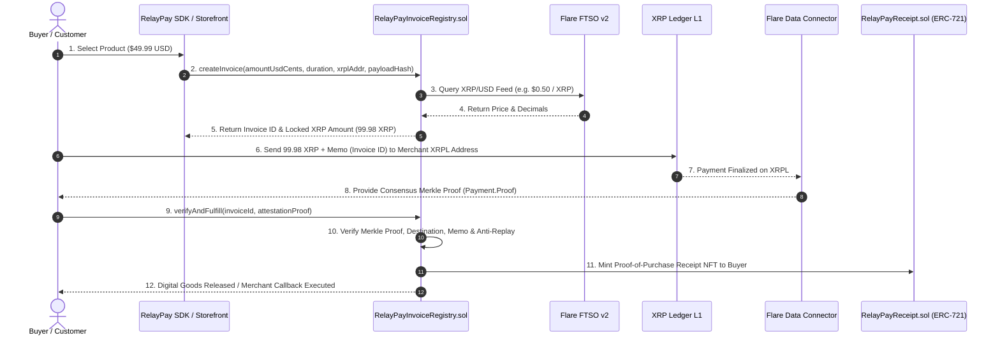

# RelayPay: Non-Custodial XRP Merchant Checkout & SDK on Flare EVM

> **Flare Hackathon Track:** Flare Infrastructure & Cross-Chain Commerce  
> **Tagline:** Turn native XRPL payments into cryptographically proven, exactly-once smart contract fulfillment on Flare EVM via the Flare Data Connector (FDC) and Flare Time Series Oracle (FTSO v2).

[](https://getfoundry.sh/)
[](LICENSE)
[](#security--test-suite)

---

## 🚀 Overview

Native XRP transactions on the XRP Ledger (XRPL) are fast (~3-5 second finality) and cheap, but native XRPL transactions **cannot natively call EVM smart contracts**.

**RelayPay** bridges this gap without wrapping tokens or relying on centralized payment gateways:
1. **Direct Non-Custodial Settlement:** Customers pay native XRP directly to the merchant's native XRPL address.
2. **Flare Data Connector (FDC):** FDC attests to the exact XRPL transaction (amount drops, destination address, memo/invoice ID, block timestamp) and outputs a consensus Merkle proof verified on Flare.
3. **Flare Time Series Oracle (FTSO v2):** Real-time XRP/USD price feeds lock dynamic fiat-denominated quotes at invoice creation.
4. **On-Chain Dynamic SVG Proof-of-Purchase:** Upon successful verification, RelayPay mints an ERC-721 Receipt NFT (`RPR-XRP`) directly to the buyer's EVM wallet containing dynamic vector SVG metadata generated directly on-chain.

---

## 📐 Architecture & Payment Lifecycle



---

## 🛡️ Smart Contracts Specification

### Core Contracts (`src/`)

| Contract | Description |
| :--- | :--- |
| **[`RelayPayInvoiceRegistry.sol`](file:///home/web-ghost/relaypay/src/RelayPayInvoiceRegistry.sol)** | Core state machine managing expiring invoices, FTSO dynamic conversions, FDC proof verification, anti-replay, and underpay/overpay transitions. |
| **[`RelayPayReceipt.sol`](file:///home/web-ghost/relaypay/src/RelayPayReceipt.sol)** | ERC-721 compliant On-Chain Proof-of-Purchase Receipt NFT generating vector SVG graphics and JSON metadata directly in Solidity. |

### System Interfaces & Mocks (`src/interfaces/`, `src/mocks/`)

| Interface / Mock | Purpose |
| :--- | :--- |
| **[`IFlareDataConnector.sol`](file:///home/web-ghost/relaypay/src/interfaces/IFlareDataConnector.sol)** | Official Flare Data Connector (FDC) attestation types (`Payment.Proof`, `Payment.Response`, `Payment.ResponseBody`). |
| **[`IFtsoV2.sol`](file:///home/web-ghost/relaypay/src/interfaces/IFtsoV2.sol)** | Official Flare Time Series Oracle v2 (`getFeedValue`, `getFeedById`). |
| **[`IRelayPay.sol`](file:///home/web-ghost/relaypay/src/interfaces/IRelayPay.sol)** | RelayPay protocol interface, data structures, and events. |
| **[`IRelayPayFulfillment.sol`](file:///home/web-ghost/relaypay/src/interfaces/IRelayPayFulfillment.sol)** | Callback interface for automated merchant delivery contracts. |
| **[`MockFdcVerification.sol`](file:///home/web-ghost/relaypay/src/mocks/MockFdcVerification.sol)** | Mock FDC verification engine for unit and invariant testing. |
| **[`MockFtsoV2.sol`](file:///home/web-ghost/relaypay/src/mocks/MockFtsoV2.sol)** | Mock FTSO v2 oracle feed publisher for testing price fluctuations. |

---

## ⚡ Edge Cases & State Machine Transitions

RelayPay implements an exhaustive, security-audited state machine:

- **`FULFILLED`**: Exact XRP drops received before expiration. Receipt NFT minted and callback executed.
- **`UNDERPAID`**: Partial XRP payment received. Balance recorded; allows top-up payments referencing the same invoice ID memo.
- **`OVERPAID_FULFILLED`**: XRP drops received exceed required invoice amount. Product fulfilled immediately; surplus logged for refund/credit.
- **`EXPIRED_PAID`**: XRPL payment timestamp exceeds expiration window. Auto-delivery prevented; buyer recorded for merchant manual release (`forceFulfillExpired`).
- **`CANCELLED`**: Pending unpaid invoice cancelled by merchant.
- **`REJECTED_REPLAY`**: Anti-replay check `processedTxHashes` rejects recycled XRPL transaction hashes.
- **`PRE_EXISTING_REJECTED`**: Rejects payments with XRPL block timestamps prior to invoice creation timestamp.

---

## 🧪 Security & Test Suite

The test suite includes **Unit Tests**, **Re-entrancy Attack Verification**, **Randomized Fuzz Testing**, and **Multi-Step Invariant Verification**:

```shell
# Run all tests
forge test

# Run tests with verbose traces
forge test -vvv

# Run gas snapshots
forge snapshot

# Run coverage report
forge coverage
```

### Test Summary (13/13 Tests Passing)
- **`RelayPayInvoiceRegistryTest`** (5 unit tests covering lifecycle, pricing, top-ups, anti-replay, memo checks)
- **`RelayPaySecurityTest`** (2 security tests verifying `ReentrancyGuard` and restricted receipt minting)
- **`RelayPayFuzzTest`** (3 fuzz tests running 256 randomized iterations on drops, oracle rates, and timestamps)
- **`RelayPayInvariantTest`** (3 invariant tests running 1,920 state transitions proving global invariants)

---

## 📦 Deployment & Configuration

Deploy to Flare Coston2 Testnet or Flare Mainnet:

```shell
export PRIVATE_KEY=0x...
export FDC_VERIFICATION_ADDRESS=0x1000000000000000000000000000000000000001
export FTSO_V2_ADDRESS=0x1000000000000000000000000000000000000002
export XRP_USD_FEED_ID=0x014152502f55534400000000000000000000000000

forge script script/DeployRelayPay.s.sol:DeployRelayPay --rpc-url https://coston2-api.flare.network/ext/C/rpc --broadcast
```

---

## 📜 License

MIT License. Copyright (c) 2026 Webghost01-NG.
